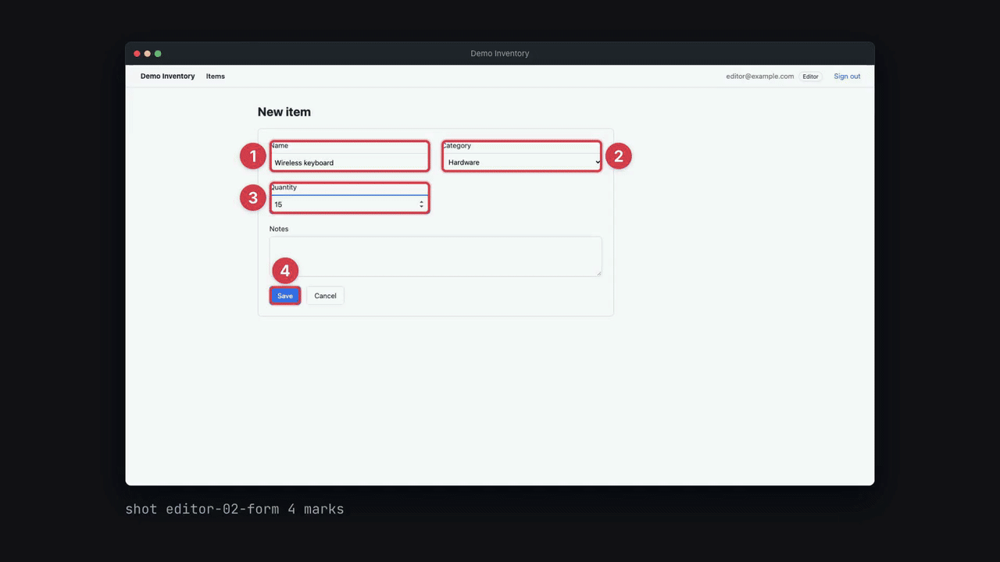
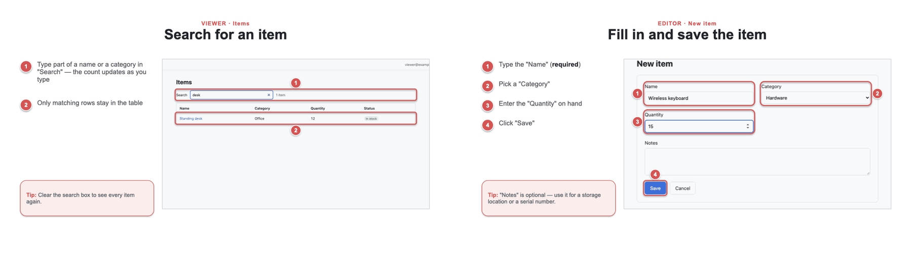
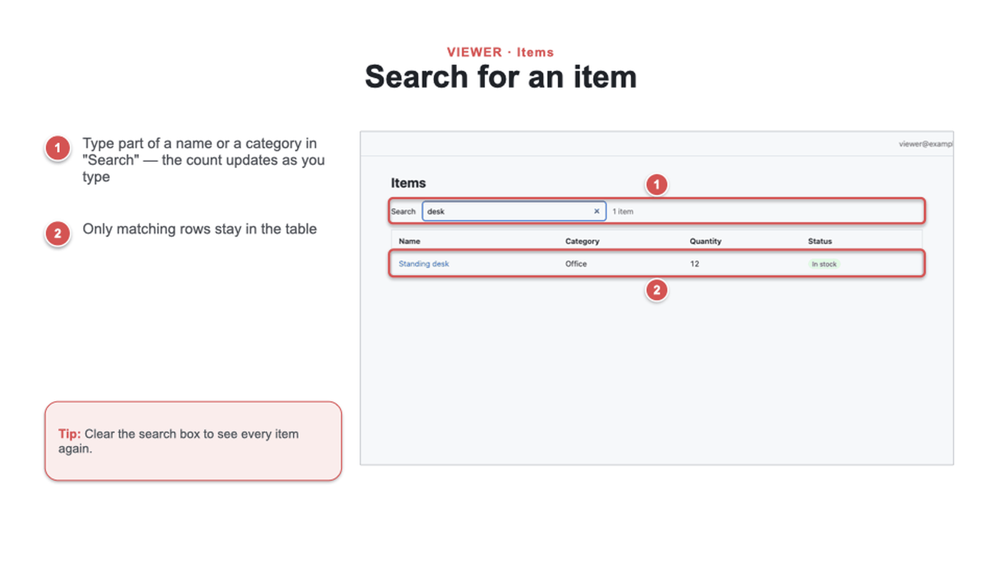
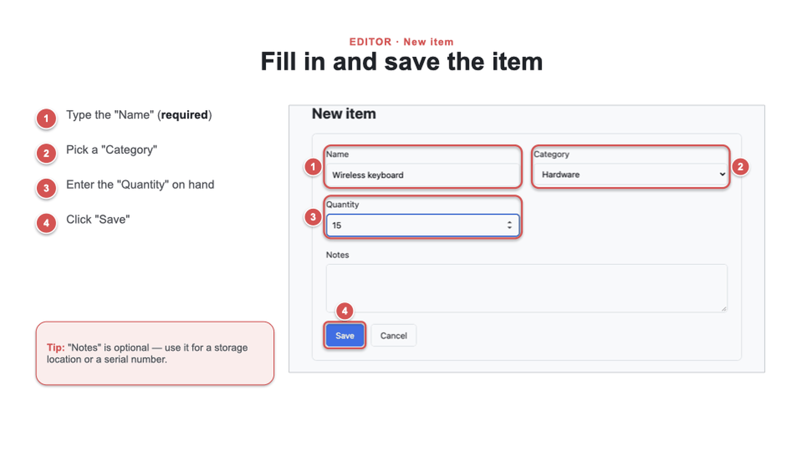
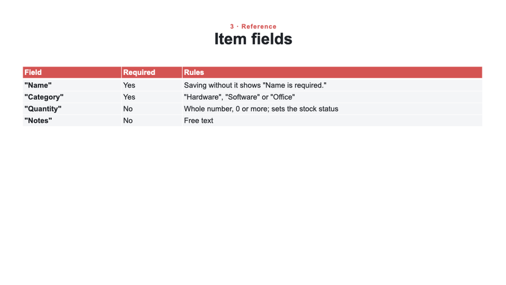

# MSlides

[](https://github.com/JiramedFirst/MSlides/actions/workflows/smoke.yml)

Claude Code plugin that makes user-manual slide decks for a web app. It captures each screen with Playwright, draws
a numbered box for every step, and builds one editable PPTX (and PDF) per role.

[](https://github.com/JiramedFirst/MSlides/releases/download/v1.1.0/MSlides-demo.mp4)



## Install

```
/plugin marketplace add JiramedFirst/MSlides
/plugin install mslides@mslides
```

## Use

Run your app locally with one test account per role, then ask Claude:

> Make a user manual for the Viewer and Editor roles of the app on localhost:3000.

Claude reads the code for the tasks and the exact UI labels, shows you the task list, then captures the screens,
builds the decks, and checks the rendered pages. The output goes to `<workspace>/out/`: an editable PPTX per
edition, a PDF next to it, and with `--md` a Markdown edition (cropped shots with the numbered boxes) for a wiki.

Later you can ask it to refresh the manual after a UI change, or to edit a slide ("change step 2 on editor-02").

## Requirements

- Python 3.10+ and Node 18+. `python3 <skill>/scripts/setup.py <workspace>` sets up the rest: a venv with the
  skill's packages, Playwright + chromium in the workspace (by hand: `npm i -D playwright && npx playwright install chromium`).
- A PDF renderer (optional). macOS, Linux and Windows are supported:

| | bash (macOS / Linux) | PowerShell (Windows) |
|---|---|---|
| set a password | `export MANUAL_PW_VIEWER='…'` | `$env:MANUAL_PW_VIEWER='…'` |
| PDF renderer | Keynote (macOS), LibreOffice (Linux) | PowerPoint or LibreOffice |

## Passwords

Capture reads passwords from environment variables only (`MANUAL_PW_<ROLE>`; `MANUAL_PW` is the fallback). It
never writes them to a file or prints them.

Capture refuses non-loopback hosts unless you list them in `capture.allow_hosts`. Don't point it at production.
Screenshots of internal screens may be confidential, so treat the decks that way.

## Demo

`examples/demo-app/` is a small static app, and `examples/demo/` holds the manual captured from it.

| Task slide | Form | Reference table |
|---|---|---|
|  |  |  |

The smoke test serves the demo, replays the capture, builds every edition (PDF + Markdown, plus a dark-template
build), and checks them — the same script CI runs on Ubuntu and Windows:

```bash
PYTHON=.venv/bin/python NODE_PATH=/path/to/node_modules python tests/smoke.py
```

## License

MIT
